# 🛡️ TechCare SafeGuard: Autonomous Incident Response System

An automated, multi-agent industrial emergency incident containment system built with **Band.ai** and **Groq API**. 

This project demonstrates a robust multi-agent orchestration protocol where agents collaborate in real-time to mitigate industrial alerts, perform technical resolution steps, and conduct strict safety audits before executing any containment commands.

---

## 🌟 Key Features
1. **Multi-Agent Orchestration Protocol:** Uses Band.ai for chat-based interaction and coordination between specialized agents.
2. **Robust Safety Audit Loop:** 
   - **Coordinator Agent:** Extracts target equipment names and context from incoming alerts.
   - **Systems Analyst:** Proposes technical containment steps based on the incident.
   - **Safety Auditor:** Strictly evaluates the proposed steps. If a step violates safety constraints, the Auditor issues a `SAFETY_AUDIT_REJECT:`, forcing the Analyst to revise the plan until full compliance is met.
3. **LLM-Based Reasoning:** Powered by Groq API for lightning-fast inference and high-reliability reasoning for technical containment.
4. **Structured Communication Flow:** Agents use explicit message headers (`TECHNICAL_RESOLUTION:`, `SAFETY_AUDIT_REJECT:`) with structured metadata payloads to bypass history-sync latency and ensure strict operational coordination.
5. **Modern Full-Stack Dashboard:** A responsive, dark-themed UI built with Next.js (Frontend) and FastAPI (Backend) for real-time monitoring of agent logs and incident states.

---

## 🛠️ Architecture & Tech Stack

* **Frontend:** Next.js (React, Tailwind CSS)
* **Backend:** FastAPI (Python)
* **Agent Framework:** Band SDK
* **LLM Provider:** Groq API (Llama 3.1 & 3.3 models)
* **Database:** SQLite (SQLAlchemy / aiosqlite for dynamic blueprints & history tracking)
* **Deployment:** Vercel (Frontend) & Render (Backend)

---

## 🤖 Band.ai Multi-Agent Orchestration Protocol

The system utilizes the **Band SDK** to instantiate and coordinate 6 specialized, autonomous AI agents. These agents communicate asynchronously via Band chat rooms, executing a strict safety-containment feedback loop:

1. **Coordinator Agent:** Operations Desk Manager. Triggered by incoming OPC-UA/MQTT telemetry alerts. It parses the alert details, creates a dedicated Band chat room, and invites the other agents.
2. **Systems Analyst Agent:** Lead Technical Engineer. Performs a dynamic lookup of critical thresholds in the database (`dynamic_db.py`) for the target equipment, designs a containment plan, and references lockout/tagout (LOTO) protocols.
3. **Safety Auditor Agent:** Compliance Inspector. Audits the Systems Analyst's proposal. If any PPE/LOTO or environmental verification is missing, it issues a `SAFETY_AUDIT_REJECT:` feedback payload, forcing the Analyst to revise the steps. Once safe, it signs off and generates the final markdown report.
4. **Execution Agent:** Automated Systems Operator. Receives the finalized report and simulates the actuator containment sequence (e.g., closing valves, tripping breakers) on the virtual plant floor.
5. **Forensic Investigator Agent:** Root Cause Analyst. Analyzes the entire chat room chronology to compile a Forensic Root Cause Analysis (RCA) report.
6. **Knowledge Curator Agent:** Feedback & Learning Agent. Curates the incident details, extracting new failure modes or recommended threshold updates, and commits them back to the active knowledge base.

```mermaid
sequenceDiagram
    participant Telemetry Alert
    participant Coordinator Agent
    participant Systems Analyst
    participant Safety Auditor
    participant Execution Agent
    participant Forensic Investigator
    participant Knowledge Curator
    participant SQLite DB (dynamic_db)

    Telemetry Alert->>Coordinator Agent: Spikes/Alert Trigger
    Coordinator Agent->>Systems Analyst: Create Room & Alert Details
    Systems Analyst->>SQLite DB (dynamic_db): Retrieve Specs & Thresholds
    SQLite DB (dynamic_db)-->>Systems Analyst: Specifications Return
    Systems Analyst->>Safety Auditor: Propose Containment Plan (TECHNICAL_RESOLUTION)
    
    rect rgb(30, 30, 30)
        note right of Safety Auditor: Compliance & Safety Verification Check
        Safety Auditor-->>Systems Analyst: REJECT if PPE/LOTO missing (SAFETY_AUDIT_REJECT)
        Systems Analyst->>Safety Auditor: Submit Revised Resolution
    end

    Safety Auditor->>Execution Agent: Safe Containment Approved (INCIDENT_REPORT)
    Execution Agent->>Forensic Investigator: Actuator Sequence Complete (EXECUTION_STATUS)
    Forensic Investigator->>Knowledge Curator: Forensic Chronology & RCA (FORENSIC_REPORT)
    Knowledge Curator->>SQLite DB (dynamic_db): Commit System Learnings (update_spec)
```



---

## 🚀 Local Development Setup

### 1. Clone the Repository
```bash
git clone https://github.com/your-username/multi-ai-agent.git
cd multi-ai-agent
```

### 2. Backend Setup (FastAPI + Agents)
```bash
python -m venv venv
source venv/bin/activate  # On Windows: venv\Scripts\activate
pip install -r requirements.txt
```

Create a `.env` file in the root directory:
```bash
cp .env.example .env
```
Fill in your API credentials:
* `GROQ_API_KEY`: Groq Cloud API Key
* `BAND_API_KEY`: Band.ai platform key
* `BAND_BOT_IDS`: Your registered Band agents.

Run the Backend Server:
```bash
python -m uvicorn api.index:app --host 127.0.0.1 --port 8000 --reload
```

Run the SafeGuard Agents (in a separate terminal):
```bash
source venv/bin/activate
python run_agents.py
```

### 3. Frontend Setup (Next.js)
```bash
npm install
npm run dev
```
Open `http://localhost:3000` to view the real-time agent dashboard.

---

## 🌐 Deployment Plan

* **Frontend (Vercel):** The Next.js application is configured to be easily deployed on Vercel with zero configuration. 
* **Backend (Render):** The FastAPI and Background Agent Runners can be deployed on Render using the provided `render.yaml` blueprint or Dockerfile. Ensure environment variables are securely added to the deployment settings.

---

## 📱 Android Companion & Push Notifications (FCM)

TechCare SafeGuard includes integration with an Android companion application to send real-time push notifications of critical incident alerts directly to floor managers' devices.

### 1. The Companion APK
* **Pre-Signed Build:** The compiled companion application [Sync.apk](file:///home/sudo_ahilesh/Documents/Multi-AI-Agent/Sync.apk) is located in the root of the repository. It has been signed with the **v3 signature scheme** for compatibility with modern Android OS versions (Android 9 to 14+).
* **Installation:** Transfer the APK to your device, uninstall any previous versions of the app, enable "Install from Unknown Sources", and run the installer.

### 2. Dashboard Configuration
Under the **System Settings** dashboard -> **Android Companion Integration** card:
1. **Enable Push Notifications:** Check the toggle to activate notification routing.
2. **FCM Device Token:** Paste the unique **Firebase Registration Token** copied from the settings screen of the Android companion app.
3. **Minimum Alert Level:** Configure the filtering threshold:
   * `INFO`: Receives all logs and telemetry updates.
   * `WARNING`: Receives alerts for exceedances and minor faults.
   * `CRITICAL`: Receives runaway risk and active crisis alerts only.

### 3. Backend FCM Dispatcher
* Implemented in [api/agents.py](file:///home/sudo_ahilesh/Documents/Multi-AI-Agent/api/agents.py) via `send_fcm_notification`.
* If a Firebase Admin service account key is present (`api/firebase-key.json` or `FIREBASE_SERVICE_ACCOUNT` env variable), the backend initiates a real v1 FCM push notification.
* If no credentials are found, the backend outputs a debug simulation log detailing the target device token and warning payloads.

---

## 📝 License
This project is open-source and available under the MIT License.

