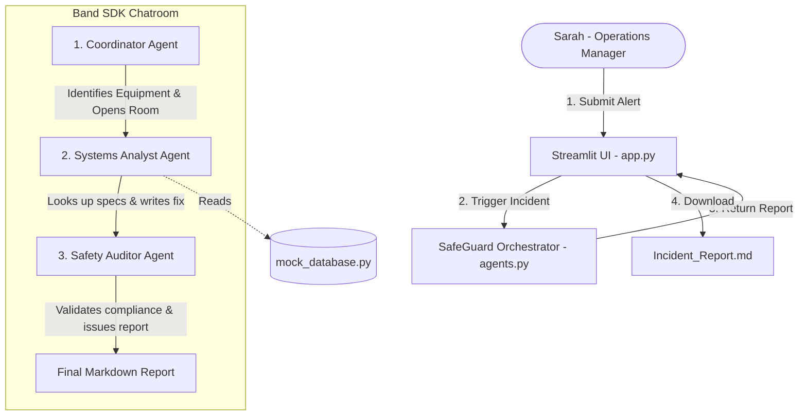

# TechCare SafeGuard - Hackathon Project Summary

An analysis of the **Band of Agents Hackathon (Lablab.ai)** slides and the implementation blueprint for winning the **5 Lakh INR** prize.

---

## 🚀 The Vision: TechCare SafeGuard
**TechCare SafeGuard** is an automated, multi-agent enterprise incident desk designed for Track 1: Enterprise Workflows. It replaces manual, slow, and expensive industrial emergency response procedures with a real-time, compliance-safe AI SafeGuard Cluster that resolves incidents in under 15 seconds.

### The Opportunity (The Pitch)
*   **The Problem:** When an industrial machine (e.g., a chemical vat or server rack) triggers a critical alert, human operators face panic, dense 500-page manuals, and safety compliance doubts. Traditional escalation takes ~45 minutes and costs up to $450,000 in downtime.
*   **The Solution:** A 3-agent AI SafeGuard Cluster running on the **Band SDK** network. The operator inputs the alert, and the safeguard coordinates, cross-references enterprise blueprints, validates safety laws, and triggers an automated containment sequence.
*   **Business Impact:**
    1.  **Zero Panic:** Simplifies complex situations for floor managers.
    2.  **Unbreakable Rules:** A dedicated auditor guarantees strict safety compliance.
    3.  **Massive Cost Savings:** Resolves crises in seconds, avoiding catastrophic line shutdowns.

---

## 🛠️ The Architecture & Technology Stack

### 1. Multi-Agent SafeGuard (Band SDK)
*   **Coordinator Agent:** The first point of contact. Detects the machine/system name, creates a Band chatroom, and hands over to the Systems Analyst.
*   **Systems Analyst Agent:** The technical resolver. Reads the equipment's specifications and safety thresholds from `mock_database.py` and produces a precise step-by-step resolution.
*   **Safety Auditor Agent:** The compliance checker. Validates the analyst's resolution against safety laws and outputs a structured compliance report.

### 2. The Brains (Groq & Grok APIs)
*   Instead of the Google Gemini API, we will use **Groq** (or **xAI Grok**) to power the agents.
*   **Why Groq?** Groq's Llama-3-based models run at extreme speed (250+ tokens/sec). This will make our multi-agent conversation run in under **5 seconds**, making the demo feel incredibly snappy and interactive.
*   **Why Grok?** Grok's reasoning capabilities are excellent for technical troubleshooting.

### 3. Front-End (Streamlit)
*   A clean Python-based dashboard. Includes quick-trigger buttons for mock industrial emergencies and a live markdown-rendered safeguard response window.

---

## 📅 Roadmap to the 5 Lakh Prize (June 19 Deadline)

| Phase | Milestone | Deliverables | Status |
| :--- | :--- | :--- | :--- |
| **Phase 1** | Synthesize Fake Data | `mock_database.py` (Vat 4, Server Rack B, Robotic Arm 9) | ⏳ Planned |
| **Phase 2** | Define System Prompts | `prompt_rules.md` (System instructions for the 3 agents) | ⏳ Planned |
| **Phase 3** | Implement SafeGuard Logic | `agents.py` (Groq API client + Band SDK agent definitions) | ⏳ Planned |
| **Phase 4** | Build Interactive UI | `app.py` (Streamlit dashboard with mock trigger buttons) | ⏳ Planned |
| **Phase 5** | Production Readiness | `requirements.txt`, `.env.example`, `README.md` | ⏳ Planned |
| **Phase 6** | Deployment & Pitch | Push to GitHub + Deploy on Streamlit Cloud | ⏳ Planned |

---

## 🏆 How to Win the Judges' Votes
1.  **Speed to Value:** Demonstrate the safeguard running in real-time. Groq's high tokens-per-second will show a 3-turn agent conversation finishing in a flash.
2.  **Safety Guardrails:** Highlight the Safety Auditor. In enterprise software, safety and liability are everything. Showing a separate auditor validating actions is a huge selling point.
3.  **Clean Code & Architecture:** The code is modular, well-documented, and utilizes the sponsor's SDK (`band-sdk`) properly.
